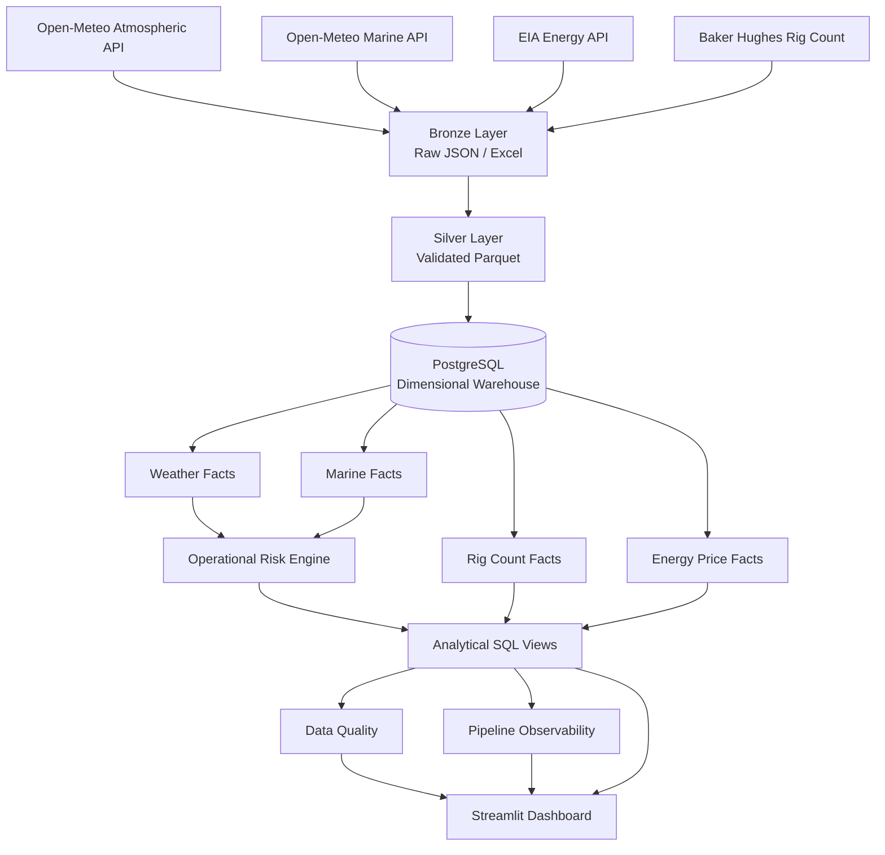

# 🛢️ Oil & Gas Data Engineering Platform

An end-to-end data engineering project integrating **offshore atmospheric and marine forecasts, operational weather risk, Baker Hughes rig activity, EIA energy-market data, PostgreSQL dimensional modeling, automated data quality, pipeline observability, and an interactive Streamlit dashboard**.

The project demonstrates my ability to design and build a production-style data platform that transforms heterogeneous operational and market data into analytics-ready datasets and decision-support products.

---

## 🧾 Executive Summary — For Hiring Managers

- ✅ **End-to-end pipeline:** Built ingestion, transformation, warehouse loading, validation, observability, and visualization workflows using Python and SQL
- ✅ **Multiple real-world data sources:** Integrated REST APIs, JSON payloads, Excel files, Parquet datasets, and PostgreSQL
- ✅ **Data modeling:** Designed fact and dimension tables for weather, marine forecasts, rig activity, energy prices, assets, locations, and time
- ✅ **Operational analytics:** Created offshore weather-risk logic using asset-specific wind, gust, wave, and visibility thresholds
- ✅ **Data quality:** Implemented 22 automated warehouse validation checks covering integrity, grain, ranges, references, and analytical views
- ✅ **Observability:** Persisted pipeline execution status, duration, failures, and quality-check results in PostgreSQL
- ✅ **Analytics layer:** Built business-ready SQL views for operational forecasting, rig-market analysis, energy intelligence, and executive KPIs
- ✅ **Frontend:** Developed an interactive Streamlit + Plotly operations dashboard connected directly to PostgreSQL

### If you only have a minute, review these:

1. [`src/main.py`](src/main.py) — master pipeline orchestration
2. [`src/pipelines/weather_pipeline.py`](src/pipelines/weather_pipeline.py) — offshore weather pipeline
3. [`src/quality/validate_warehouse.py`](src/quality/validate_warehouse.py) — automated data-quality framework
4. [`src/warehouse/pipeline_observability.py`](src/warehouse/pipeline_observability.py) — pipeline monitoring and persistence
5. [`src/dashboard/app.py`](src/dashboard/app.py) — interactive operations dashboard

---

## 🎯 Problem & Context

Oil & Gas operations depend on multiple sources of information that usually arrive in different formats, update at different frequencies, and serve different business purposes.

Operational teams may need to answer questions such as:

- 🌊 **Offshore conditions:** Are wind, waves, gusts, and visibility within operational limits?
- ⚠️ **Operational risk:** Which offshore assets are approaching or exceeding weather thresholds?
- 🟢 **Safe windows:** When are conditions suitable for offshore operations?
- 🛢️ **Energy market:** How are relevant energy-price observations evolving?
- 🏗️ **Rig activity:** How is drilling activity changing across countries and regions?
- 🔍 **Data reliability:** Is the warehouse complete, consistent, and ready for analysis?
- ⚙️ **Pipeline health:** Did the latest data pipeline succeed, how long did it take, and did all quality checks pass?

The challenge is not simply obtaining the data.

The challenge is building a system that can:

```text
INGEST
   ↓
STANDARDIZE
   ↓
MODEL
   ↓
VALIDATE
   ↓
MONITOR
   ↓
ANALYZE
   ↓
DELIVER
```

This project addresses that problem with a Python + SQL data engineering architecture.

---

## 🏗️ Architecture



---

## 🧰 Tech Stack

- 🐍 **Programming:** Python
- 🗄️ **Database:** PostgreSQL
- 🧮 **SQL:** Dimensional modeling, joins, aggregations, CTEs, analytical views, upserts
- 📦 **Data Processing:** Pandas + PyArrow
- 🪶 **Storage Format:** Parquet
- 🌐 **APIs:** REST APIs using Requests
- 📄 **External Files:** JSON + Excel
- 🔗 **Database Integration:** SQLAlchemy + Psycopg2
- ✅ **Data Quality:** Custom Python/SQL validation framework
- 👀 **Observability:** Pipeline-run and quality-result persistence
- 📊 **Visualization:** Streamlit + Plotly
- 📝 **Logging:** Loguru
- ⚙️ **Configuration:** python-dotenv
- 🔀 **Version Control:** Git + GitHub

---

## 🌐 Data Sources

| Domain | Source | Type | Purpose |
|---|---|---|---|
| Atmospheric Weather | Open-Meteo | REST API / JSON | Wind, gusts, temperature, pressure, humidity, visibility |
| Marine Weather | Open-Meteo Marine | REST API / JSON | Waves, swell, SST, currents |
| Energy Market | U.S. EIA | REST API / JSON | Energy-price observations |
| Rig Activity | Baker Hughes | Excel | Worldwide drilling activity |

---

## 📂 Repository Structure

```text
oil-gas-data-engineering/
│
├── data/
│   ├── raw/                       # Bronze layer
│   ├── processed/                 # Silver Parquet
│   └── reference/                 # Asset registry
│
├── docs/
│   └── images/
│
├── logs/
│
├── sql/
│
├── src/
│   ├── api/                       # API clients
│   ├── config/                    # Configuration + database
│   ├── dashboard/                 # Streamlit frontend
│   ├── extract/                   # Source extraction
│   ├── load/                      # Load utilities
│   ├── pipelines/                 # Pipeline orchestration
│   ├── quality/                   # Data-quality framework
│   ├── transform/                 # Bronze → Silver
│   ├── utils/                     # Shared utilities
│   └── warehouse/                 # Facts, dimensions, views
│
├── .env.example
├── .gitignore
├── pyproject.toml
├── requirements.txt
├── run_dashboard.sh
├── run_pipeline.sh
└── README.md
```

---

# 🏗️ Project Overview

## 1️⃣ Multi-Source Data Ingestion

The project handles multiple ingestion patterns rather than relying on a single dataset.

### Atmospheric Weather

The atmospheric pipeline retrieves hourly forecasts including:

- Temperature
- Relative humidity
- Precipitation
- Mean sea-level pressure
- Wind speed
- Wind direction
- Wind gusts
- Visibility
- Weather code

### Marine Weather

Marine forecasts include:

- Wave height
- Wave direction
- Wave period
- Wind-wave height
- Swell-wave height
- Swell-wave direction
- Swell-wave period
- Sea-surface temperature
- Ocean-current velocity
- Ocean-current direction

### Energy Prices

Energy-market observations are retrieved through the EIA API and standardized before warehouse loading.

> The current EIA dataset represents a refined-product price series and is intentionally presented as **Energy Price Intelligence**, not as WTI crude oil.

### Worldwide Rig Count

Baker Hughes Excel data is extracted and transformed into standardized drilling-activity records by:

- Region
- Country
- Drilling target
- Location type
- Rig status
- Observation month

---

## 2️⃣ Bronze Layer

The Bronze layer preserves source data before transformation.

```text
data/raw/weather/atmospheric/
data/raw/weather/marine/
data/raw/oil_prices/
data/raw/rig_count/
```

API responses are retained as JSON while the Baker Hughes source workbook is preserved in its original Excel format.

This separates **source ingestion** from downstream business transformations.

---

## 3️⃣ Silver Layer

Raw source data is standardized into analytics-ready Parquet datasets.

```text
data/processed/weather/atmospheric_forecast.parquet
data/processed/weather/marine_forecast.parquet
data/processed/weather/operational_weather_risk.parquet

data/processed/oil_prices/oil_prices.parquet

data/processed/rig_count/rig_count.parquet
```

Transformations include:

- Schema normalization
- Data-type enforcement
- Timestamp standardization
- Source metadata
- Asset enrichment
- Data cleaning
- Business-rule preparation

---

## 4️⃣ Dimensional Warehouse

PostgreSQL is used as the analytical warehouse.

### Dimension Tables

```text
dim_time
dim_location
dim_asset
dim_country
dim_rig_classification
dim_energy_product
```

### Fact Tables

```text
fact_weather_forecast
fact_marine_forecast
fact_operational_weather_risk

fact_rig_count

fact_oil_price

fact_pipeline_run
fact_data_quality_check
```

The design separates descriptive entities from measurable operational events and supports reusable SQL analytics across multiple business domains.

---

## 5️⃣ Offshore Operational Risk Engine

A reference asset registry defines operational thresholds for demonstration offshore assets.

Example configuration:

```text
asset_id
asset_name
asset_type
operator_name
latitude
longitude
max_wind_kmh
max_gust_kmh
max_wave_height_m
minimum_visibility_m
```

Forecast values are evaluated against these asset-specific limits.

### Risk Classification

```text
GREEN    → conditions comfortably within operational limits
AMBER    → conditions approaching operational limits
RED      → operational limit exceeded
UNKNOWN  → required observation unavailable
```

Risk is evaluated independently for:

- Wind
- Wind gusts
- Wave height
- Visibility

The results are combined into an overall hourly operational-risk classification.

> The asset registry contains portfolio demonstration assets and does not represent real offshore installations.

---

## 6️⃣ Analytical SQL Layer

Instead of connecting the dashboard directly to raw fact tables, PostgreSQL exposes reusable business-ready views.

### Offshore Operations

```text
vw_offshore_operational_forecast
vw_latest_offshore_forecast
vw_offshore_safe_windows
vw_offshore_risk_summary
vw_offshore_critical_periods
```

### Rig Market

```text
vw_rig_count_history
vw_rig_count_country_monthly
vw_rig_count_region_monthly
vw_latest_rig_count
vw_rig_count_monthly_change
```

### Integrated Intelligence

```text
vw_executive_energy_operations
vw_asset_operational_kpis
vw_next_weather_critical_event
```

### Pipeline Observability

```text
vw_latest_pipeline_run
vw_latest_quality_summary
vw_latest_quality_checks
vw_pipeline_run_history
```

This creates a semantic layer between the warehouse and consuming applications.

---

## 7️⃣ Automated Data Quality

The warehouse includes a custom validation framework with **22 automated checks**.

The checks validate areas including:

- Required database objects
- Non-empty fact tables
- Duplicate fact-table grain
- Dimension-key integrity
- Weather/marine/risk alignment
- Humidity ranges
- Visibility ranges
- Wave-height validity
- Risk classification validity
- Analytical-view grain

A successful execution produces:

```text
Checks passed: 22
Checks failed: 0
Total checks: 22
```

Unlike a simple console-only test framework, results are persisted into PostgreSQL.

---

## 8️⃣ Pipeline Observability

Every master pipeline execution creates a record in:

```text
fact_pipeline_run
```

The platform captures:

- Pipeline name
- Start timestamp
- Finish timestamp
- Execution duration
- Status
- Error message

Each individual validation result is written to:

```text
fact_data_quality_check
```

This enables historical monitoring of pipeline reliability.

A failed run remains in history instead of being silently discarded.

---

## 9️⃣ Streamlit Operations Dashboard

The frontend is implemented using Streamlit and Plotly.

### Executive Operations Center

Provides:

- Latest rig-count activity
- Energy-price KPI
- Number of monitored assets
- GREEN / AMBER / RED exposure
- Asset availability
- Regional rig trends
- Upcoming critical weather periods

### Offshore Operations

Provides:

- Wind-speed forecasts
- Wind-gust forecasts
- Wave and swell forecasts
- Visibility forecasts
- Operational-risk timeline
- Asset-specific filtering

### Rig Market

Provides:

- Global rig-count evolution
- Regional comparison
- Latest reporting month
- Historical trends

### Energy Intelligence

Provides:

- Latest energy-market observations
- Historical price trends
- CSV export

### Data Quality & Pipeline Health

Provides live PostgreSQL observability for:

- Pipeline status
- Execution duration
- Quality-check totals
- Pass rate
- Failed validations
- Historical pipeline runs
- Warehouse fact-table volumes

---

# 📊 Key Engineering Outcomes

### 🌊 Offshore Weather

Atmospheric and marine information that originally arrives through independent APIs is combined at a common:

```text
asset
+
forecast reference time
+
forecast valid time
```

grain.

This enables operational risk to be calculated consistently across weather domains.

### 🏗️ Rig Market

The Baker Hughes workbook was transformed from a reporting-oriented Excel structure into analytics-ready observations that can be aggregated by time, country, region, drilling target, and operational category.

### 🔍 Data Reliability

Data quality is treated as part of the pipeline itself rather than as a manual post-processing activity.

A successful master run requires warehouse validation to succeed.

### 👀 Observability

Pipeline failures and successes are retained historically, allowing the dashboard to distinguish between data health and pipeline health.

### 📈 Analytics

The dashboard consumes curated analytical views rather than embedding complex transformation logic inside the visualization layer.

---

# 💻 Data Engineering Skills Demonstrated

## Python Engineering

- Modular Python project structure
- REST API clients
- Retry-enabled HTTP extraction
- JSON processing
- Excel ingestion
- Pandas transformations
- Parquet serialization
- Configuration management
- Structured application logging
- Exception handling
- Reusable pipeline functions

## SQL & Data Modeling

- PostgreSQL
- Fact and dimension modeling
- Surrogate keys
- Foreign-key relationships
- Unique business grain
- `INNER JOIN` / `LEFT JOIN`
- CTEs
- Aggregations
- Conditional aggregation
- Analytical views
- `CREATE OR REPLACE VIEW`
- Upsert patterns
- Indexing
- Range and integrity validation

## Data Pipeline Design

- Bronze / Silver / Warehouse architecture
- Multiple heterogeneous sources
- Idempotent loading
- Forecast-run preservation
- Reference/master-data enrichment
- Business-rule transformations
- Data-quality gates
- Pipeline orchestration
- Pipeline observability

## Analytics Engineering

- Semantic SQL views
- Business KPI calculation
- Operational risk metrics
- Cross-domain executive reporting
- Dashboard-ready datasets
- Separation of transformation and presentation layers

## DataOps

- Automated validation
- Pipeline execution metadata
- Failure persistence
- Historical monitoring
- Environment-variable configuration
- Reproducible Python dependencies
- Git/GitHub version control

---

# 🚀 Running the Project

## 1. Clone

```bash
git clone https://github.com/mfretta/oil-gas-data-engineering.git
cd oil-gas-data-engineering
```

---

## 2. Create Virtual Environment

```bash
python -m venv .venv
```

Windows Git Bash:

```bash
source .venv/Scripts/activate
```

---

## 3. Install Dependencies

```bash
python -m pip install -r requirements.txt
```

or:

```bash
python -m pip install -e .
```

---

## 4. Configure Environment

Copy:

```text
.env.example
```

to:

```text
.env
```

and configure:

```env
EIA_API_KEY=your_eia_api_key

DB_HOST=localhost
DB_PORT=5432
DB_NAME=energy_weather
DB_USER=weather_user
DB_PASSWORD=your_password
```

Never commit `.env`.

---

## 5. Run the Data Pipeline

```bash
./run_pipeline.sh
```

or:

```bash
PYTHONPATH=. ./.venv/Scripts/python.exe -m src.main
```

---

## 6. Run the Dashboard

```bash
./run_dashboard.sh
```

or:

```bash
PYTHONPATH=. ./.venv/Scripts/python.exe -m streamlit run src/dashboard/app.py
```

---

# 🔄 Pipeline Flow

```text
External Sources
      │
      ▼
Extraction
      │
      ▼
Bronze Raw Data
      │
      ▼
Transformation
      │
      ▼
Silver Parquet
      │
      ▼
PostgreSQL Warehouse
      │
      ├──── Weather
      ├──── Marine
      ├──── Rig Count
      └──── Energy Price
      │
      ▼
Operational Risk
      │
      ▼
Analytical Views
      │
      ▼
Data Quality
      │
      ▼
Pipeline Observability
      │
      ▼
Streamlit Dashboard
```

---

# 🗺️ Future Development

- ⏱️ Airflow or Prefect orchestration
- 🐳 Docker / Docker Compose
- ☁️ Cloud PostgreSQL deployment
- 📦 Object-storage Bronze/Silver layers
- 🔄 Incremental ingestion
- 🚨 Automated pipeline alerts
- 🧪 CI/CD data-quality tests
- 🔨 dbt analytical transformations
- 🛢️ Brent and WTI price benchmarks
- 🌦️ Historical forecast verification
- 🟢 Offshore safe-window optimization
- 📡 Additional offshore assets and regions
- 📊 Power BI semantic/reporting layer

---

# ⚠️ Disclaimer

This project is intended for **educational and portfolio purposes**.

The offshore assets are demonstration assets and should not be interpreted as real industrial facilities.

Operational-risk classifications are simplified portfolio examples and are not intended for real-world offshore safety or operational decision-making.

---

# 👤 Author

**Murilo Fretta**

Data Engineering · Meteorology · Offshore Energy Analytics