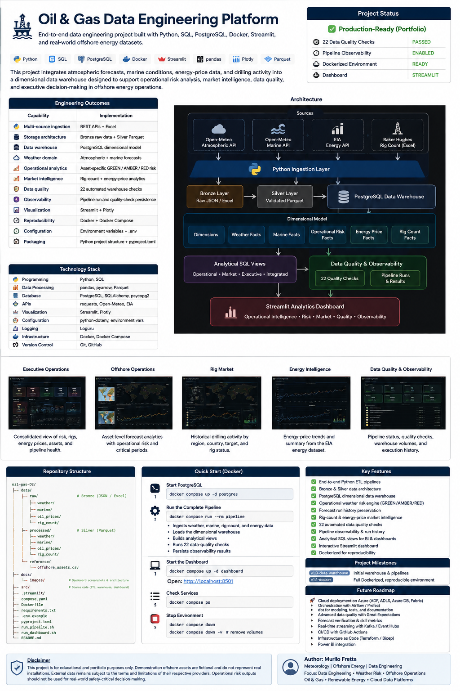

# Oil & Gas Data Engineering Platform

> End-to-end data engineering project built with **Python, SQL, PostgreSQL, Docker, Streamlit, Parquet, and real-world offshore-energy datasets**.

This project integrates atmospheric forecasts, marine conditions, energy-price data, and drilling activity into a dimensional data warehouse designed to support operational risk analysis, market intelligence, data quality, observability, and executive decision-making.

---

## Executive Summary

This project demonstrates how heterogeneous operational and market datasets can be engineered into a reproducible analytics platform.

The platform combines:

- Open-Meteo atmospheric forecasts
- Open-Meteo marine forecasts
- Baker Hughes Worldwide Rig Count
- U.S. EIA energy-price data
- Bronze and Silver data layers
- PostgreSQL dimensional modeling
- operational weather-risk logic
- analytical SQL views
- **22 automated data-quality checks**
- pipeline observability
- Streamlit + Plotly analytics
- interactive geospatial asset monitoring
- Docker Compose reproducibility

The project is intentionally built around **offshore energy operations rather than a generic e-commerce dataset**, connecting data engineering decisions with a real operational domain.

---

## Project Status

| Capability | Status |
|---|---|
| Multi-source ingestion | ✅ Complete |
| Bronze raw layer | ✅ Complete |
| Silver Parquet layer | ✅ Complete |
| PostgreSQL dimensional warehouse | ✅ Complete |
| Weather + marine facts | ✅ Complete |
| Rig-count warehouse | ✅ Complete |
| Energy-price warehouse | ✅ Complete |
| Operational weather-risk engine | ✅ Complete |
| Analytical SQL views | ✅ Complete |
| Data quality | ✅ 22 checks |
| Pipeline observability | ✅ Complete |
| Interactive offshore basemap | ✅ Complete |
| Streamlit dashboard | ✅ Complete |
| Docker Compose environment | ✅ Complete |

---

## Engineering Outcomes

| Capability | Implementation |
|---|---|
| Multi-source ingestion | REST APIs + Excel |
| Storage architecture | Bronze raw data + Silver Parquet |
| Data warehouse | PostgreSQL dimensional model |
| Weather domain | Atmospheric + marine forecasts |
| Operational analytics | Asset-specific GREEN / AMBER / RED risk |
| Geospatial analytics | Interactive monitored-asset basemap |
| Market intelligence | Rig-count + energy-price analytics |
| Data quality | 22 automated warehouse checks |
| Observability | Pipeline run + quality-check persistence |
| Visualization | Streamlit + Plotly + interactive geospatial asset map |
| Reproducibility | Docker + Docker Compose |
| Configuration | Environment variables + `.env` |
| Packaging | `pyproject.toml` + modular `src/` layout |

---

# Architecture



### Engineering Flow

```text
Sources
   ↓
Python Ingestion
   ↓
Bronze — Raw JSON / Excel
   ↓
Silver — Validated Parquet
   ↓
PostgreSQL Dimensional Warehouse
   ↓
Analytical SQL Views
   ↓
Data Quality + Observability
   ↓
Streamlit Operational Analytics
   ↓
Interactive Geospatial Decision Support